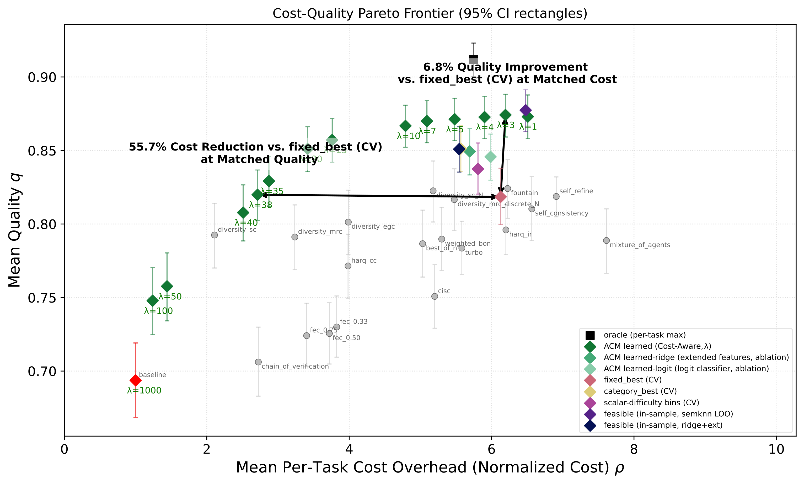
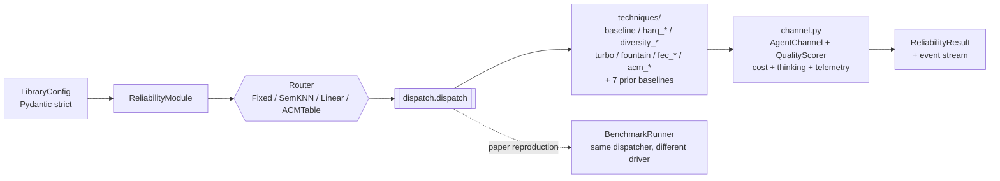

# AgentCodec

## A unifying, cost-aware reliability framework for LLM agents: prior methods and communication-theoretic techniques behind one interface.


AgentCodec wraps every LLM call in a **technique** drawn from classical communication theory: HARQ for iterative refinement, diversity combining for ensembles of models, FEC for redundancy under budget pressure, ACM routing for adaptive coding/modulation. **28 reliability techniques**: **21 communication-theoretic** methods across six families (HARQ, turbo, fountain, FEC, diversity combining, ACM routing) and **7 prior-method baselines** (Self-Consistency, Self-Refine, Chain-of-Verification, Best-of-N, Weighted Best-of-N, CISC, Mixture-of-Agents), all measured against an uncoded single-pass `baseline` (29 dispatchable entries in `KNOWN_TECHNIQUES`, counting that reference). See the [breakdown](#technique-breakdown) below.

It started as the reference implementation for the working paper *A Communication-Theoretic Framework for LLM Agents: Cost-Aware Adaptive Reliability* and ships as a library you can drop into an app.

As an early release, this project may have rough edges and known limitations. Feedback and issue reports are welcome.

Working paper: [A Communication-Theoretic Framework for LLM Agents: Cost-Aware Adaptive Reliability](https://arxiv.org/abs/2605.09121)

> **License:** Source-available under the [PolyForm Noncommercial License 1.0.0](./LICENSE) — free for research, teaching, and personal / internal noncommercial evaluation. Commercial use requires a separate license — see [COMMERCIAL.md](./COMMERCIAL.md).

## Why is it useful



On our paper benchmark, the **SemKNN** cost-aware router achieves up to **~56% cost reduction at matched quality**, or **~7% quality improvement at matched cost**, vs. best fixed prior-method we compared against (Cross-Validated). The single knob `λ` ("lambda") slides the operating point along the frontier: `λ = 3` increases quality at matched cost, `λ = 38` cuts ~56% of cost while keeping the quality. The other techniques in the chart are individually useful too — `harq_ir` for iterative refinement, `diversity_mrc` for multi-model ensembling, `turbo` for generator/critic loops.

> **SemKNN is a remote service in this release.** The trained SemKNN artifacts (q-matrix derived from benchmark runs) are not redistributed, but SemKNN is available through a free to use API server; the client encodes your prompt locally with a BGE small model (only the resulting unit-norm embedding) and use it to call the aforementioned API endpoint. All other routers (`fixed`, `acm_table`, `acm_linear`) run fully locally. See [§privacy & data flow](#privacy--data-flow).

---

## Table of contents

- [Install](#install)
- [Drop-in for OpenAI / Anthropic / Ollama](#drop-in-for-openai--anthropic--ollama)
- [Quickstart](#quickstart)
- [Cost transparency](#cost-transparency)
- [Configuration](#configuration)
  - [Models](#models)
  - [Thinking models](#thinking-models)
  - [Strategies: fixed vs routed](#strategies-fixed-vs-routed)
  - [Defaults](#defaults)
- [SemKNN — the recommended router (remote)](#semknn--the-recommended-router-remote)
- [Streaming API](#streaming-api)
- [Evaluation — comparing configurations](#evaluation--comparing-configurations)
  - [Tiered scoring (`score_strategy`)](#tiered-scoring-score_strategy)
  - [Code scoring](#code-scoring)
- [FastAPI / WebSocket example](#fastapi--websocket-example)
- [Anonymous telemetry](#anonymous-telemetry)
- [Cancellation, errors, and timeouts](#cancellation-errors-and-timeouts)
- [Per-technique reference](#per-technique-reference)
- [Result format](#result-format)
- [Python API reference](#python-api-reference)
- [CLI reference](#cli-reference)
- [Architecture](#architecture)
- [Benchmark runner (paper reproduction)](#benchmark-runner-paper-reproduction)
- [What's fully implemented vs scaffolded](#whats-fully-implemented-vs-scaffolded)
- [Citation](#citation)
- [License](#license)

---

## Install

> **Heads up — not on PyPI yet.** The first cut is install-from-source via Git. Once the release pipeline (PyPI publish + signed tags + CI green on 3.10/3.11/3.12) is wired up, the regular `pip install agentcodec[…]` will Just Work — but until then, use one of the two paths in this section.

### Path A — clone + editable install (recommended for hacking)


```bash
git clone https://github.com/intellerce/agentcodec.git
cd agentcodec
```

We recommend creating your own python environment before installation. You can use `setup.sh` to do so using `uv` as explained below.

```bash
# Core install — pydantic, numpy, httpx, and fastembed (ONNX-runtime BGE
# encoder, no torch). The default encoder is **bge-small-en-v1.5** (384-d,
# ~130 MB downloaded on first use, ~10 ms CPU per embed). Required because
# every SemKNN route AND every telemetry event needs an embedding.
#
# Total footprint: ~80 MB on disk for deps + ~130 MB for the BGE model on
# first use. NO torch, NO 1.5 GB download.
pip install -e .

# Provider SDK extras — pick the ones you actually use:
pip install -e '.[openai]'              # adds the openai SDK
pip install -e '.[anthropic]'           # adds the anthropic SDK
pip install -e '.[ollama]'              # adds the ollama SDK
pip install -e '.[eval]'                # adds scipy (Evaluator stats)
pip install -e '.[benchmark]'           # adds matplotlib / pandas / datasets

# Optional heavyweight encoder (~1.5 GB) — ONLY needed if you want
# bge-large, a model fastembed doesn't ship, or you already have torch:
pip install -e '.[remote-semknn]'       # adds sentence-transformers + torch

pip install -e '.[all]'                 # everything except `dev`
pip install -e '.[dev]'                 # adds pytest + ruff + mypy
```

The `setup.sh` script wraps the same install behind a `uv`-managed virtualenv at `.venv/`:

```bash
./setup.sh           # core (with fastembed / bge-small) + dev tools
./setup.sh --remote  # ALSO adds sentence-transformers + torch (~1.5 GB)
                     # for users who need bge-large or a custom encoder
```

### Path B — direct from Git (no clone)

```bash
pip install 'git+https://github.com/intellerce/agentcodec.git'

# With extras (quote the whole spec — most shells choke on the brackets otherwise):
pip install 'agentcodec[openai] @ git+https://github.com/intellerce/agentcodec.git'
```

Pin to a tag or commit for reproducibility:

```bash
pip install 'git+https://github.com/intellerce/agentcodec.git@v0.3.0'
```

> Each install path needs `setuptools-scm` to derive the version from the git tag. If you install from a tarball without `.git/`, the version falls back to `0.3.0` (set in `pyproject.toml`).

### Requirements

Python ≥ 3.10. Local model experiments need [Ollama](https://ollama.com) or a vLLM/SGLang endpoint. Cloud experiments need provider API keys (`OPENAI_API_KEY`, `ANTHROPIC_API_KEY`, etc.). A `.env` is loaded automatically by the benchmark runner; the library facade reads keys directly from `os.environ`.

For SemKNN routing you additionally need a SemKNN backend reachable via HTTPS — the public package ships only the client. See [§privacy & data flow](#privacy--data-flow) and [COMMERCIAL.md](./COMMERCIAL.md) for hosted / self-host options.

---

## Drop-in for OpenAI / Anthropic / Ollama

If you already have working code against the OpenAI, Anthropic, or Ollama SDK, the fastest way to get reliability is to **change one import** per file. No other code changes — ``messages=[...]``, ``tools=[...]``, ``stream=True``, async/sync, and the full native response shape all keep working.

### Step 1 — swap the import

```python
- from openai import OpenAI
+ from agentcodec.openai import OpenAI

- from anthropic import Anthropic
+ from agentcodec.anthropic import Anthropic

- from ollama import Client
+ from agentcodec.ollama import Client
```

Without any further changes the wrapper is a **pure passthrough** — identical behavior to the native SDK, zero overhead, telemetry off. The native SDK is imported lazily, so you don't even need it installed until you make a call on the passthrough path.

### Step 2 — opt into reliability with one kwarg

```python
from agentcodec.openai import OpenAI

# Layer 1 — zero config (identical to vanilla openai.OpenAI)
client = OpenAI(api_key=KEY)

# Layer 2 — string preset: one extra kwarg, picks a technique.
client = OpenAI(api_key=KEY, reliability="harq_ir")

# Layer 3 — full ReliabilityModule (routed SemKNN, custom judge, ...).
from agentcodec import ReliabilityModule
client = OpenAI(
    api_key=KEY,
    reliability=ReliabilityModule.from_yaml("configs/lib/routed_semknn.yaml"),
)

resp = client.chat.completions.create(
    model="gpt-4o-mini",
    messages=[
        {"role": "system", "content": "You are a network engineer."},
        {"role": "user",   "content": "What is QUIC?"},
    ],
)
print(resp.choices[0].message.content)        # native OpenAI shape
print(resp.reliability.technique_used)        # ← reliability escape hatch
print(resp.reliability.cost_usd)
```

### Per-call override

A ``reliability=`` kwarg on the ``create()`` call wins over the client default. Pass ``reliability=False`` to bypass for one call; pass a different preset / dict / module to swap technique just for that call.

```python
client = OpenAI(api_key=KEY, reliability="harq_ir")

# This call only: bypass reliability, raw passthrough.
resp = client.chat.completions.create(
    model="gpt-4o-mini",
    messages=[...],
    reliability=False,
)

# This call only: use a heavier technique with custom knobs.
resp = client.chat.completions.create(
    model="gpt-4o-mini",
    messages=[...],
    reliability={"technique": "diversity_mrc"},
)
```

### What `reliability=` accepts

| Value | Behavior |
|-------|----------|
| ``None`` (default) | Pure passthrough — identical to the native SDK. |
| ``"harq_ir"`` (preset string) | Fixed strategy with sensible defaults. See [presets.py](agentcodec/presets.py) for the full list (``baseline``, ``harq_ir``, ``harq_cc``, ``self_refine``, ``diversity_mrc``, ``moa``, ``turbo``, ``fec``, ``semknn``, …). Model name comes from the per-call ``model=``. |
| ``{...}`` (dict) | Full ``LibraryConfig`` payload — same schema as YAML. |
| ``ReliabilityModule`` | Pre-built module — useful when you want to share one across many clients. |
| ``False`` (per-call only) | Bypass reliability for one call; equivalent to passthrough. |

### Anthropic and Ollama

The same pattern applies — the response shape preserved is the provider-native shape:

```python
from agentcodec.anthropic import Anthropic
client = Anthropic(api_key=KEY, reliability="harq_ir")
resp = client.messages.create(
    model="claude-sonnet-4-5",
    system="Be concise.",
    messages=[{"role": "user", "content": "What is QUIC?"}],
    max_tokens=256,
)
print(resp.content[0].text)                 # Anthropic content-block shape
print(resp.reliability.technique_used)
```

```python
from agentcodec.ollama import Client
client = Client(host="http://localhost:11434", reliability="diversity_mrc")
resp = client.chat(
    model="qwen2.5:7b",
    messages=[{"role": "user", "content": "What is QUIC?"}],
)
print(resp["message"]["content"])           # ollama-library dict shape
print(resp["reliability"]["technique_used"])
```

Async counterparts: ``agentcodec.openai.AsyncOpenAI``, ``agentcodec.anthropic.AsyncAnthropic``, ``agentcodec.ollama.AsyncClient``.

### Step 3 — opt into seeing technique internals (optional)

By default the shim looks exactly like the native SDK: streaming chunks carry only the **final answer** (in `delta.content` / `text_delta` / `message.content`) and **thinking** (in `delta.reasoning_content` / `thinking_delta` content_block / `message.thinking`). Intermediate reliability-layer roles (`draft`, `critique`, `verification`, `candidate`) are hidden so the answer stream stays clean.

For power users who DO want to see drafts/critiques/candidates live — e.g. to render "the critic said X" or "round 2 draft" in their UI — set `expose_reliability_stream=True`. Internal roles then surface as native chunks **with sentinel fields** (`agentcodec_role`, `agentcodec_call_id`) so existing OpenAI/Anthropic/Ollama consumers ignore them harmlessly while reliability-aware consumers can branch on them.

```python
# OpenAI: set on the client (or per-call on .create())
from agentcodec.openai import AsyncOpenAI
client = AsyncOpenAI(
    api_key=KEY,
    reliability="harq_ir",
    expose_reliability_stream=True,      # ← new opt-in
)
async for chunk in await client.chat.completions.create(
    model="gpt-4o-mini",
    messages=[{"role": "user", "content": "Explain QUIC."}],
    stream=True,
):
    delta = chunk.choices[0].delta
    role = getattr(delta, "agentcodec_role", None)
    if role == "thinking":
        # rendered separately from the answer; this still goes through
        # delta.reasoning_content (matches OpenAI's o-series shape).
        thinking_text = delta.reasoning_content or ""
    elif role in ("draft", "critique", "verification"):
        # technique internals — only present when expose_reliability_stream=True
        print(f"[{role}] {delta.content}", end="")
    else:
        # final answer — what existing code already reads
        print(delta.content or "", end="", flush=True)
```

```python
# Anthropic: drafts/critiques surface as text_delta with delta.agentcodec_role
from agentcodec.anthropic import AsyncAnthropic
client = AsyncAnthropic(api_key=KEY, reliability="harq_ir", expose_reliability_stream=True)
async with client.messages.stream(
    model="claude-sonnet-4-5",
    messages=[{"role": "user", "content": "Explain QUIC."}],
    max_tokens=1024,
) as stream:
    async for event in stream:
        if event.type == "content_block_delta":
            d = event.delta
            if d.type == "text_delta":
                role = getattr(d, "agentcodec_role", "answer")
                print(f"[{role}] {d.text}", end="", flush=True)
            elif d.type == "thinking_delta":
                # always on its own block (index 1); never mixed with answer
                pass
```

```python
# Ollama: drafts/critiques surface as message.content with message.agentcodec_role
from agentcodec.ollama import AsyncClient
client = AsyncClient(reliability="harq_ir", expose_reliability_stream=True)
async for chunk in await client.chat(
    model="qwen2.5:7b",
    messages=[{"role": "user", "content": "Explain QUIC."}],
    stream=True,
):
    msg = chunk["message"]
    role = msg.get("agentcodec_role", "answer")
    print(f"[{role}] {msg.get('content', '')}", end="", flush=True)
```

Per-call override is supported too — pass `expose_reliability_stream=True` on `.create()` / `.messages.create()` / `.chat()` to override the client default for one call. See [`examples/13_expose_reliability_stream.py`](examples/13_expose_reliability_stream.py) for a runnable side-by-side demo across all three backends.

### When to skip the shim

Reach for the native ``ReliabilityModule`` API ([§Quickstart](#quickstart)) when you want to:

* stream the **reliability layer's own events** (router decision, per-technique progress, warnings) — the compat shim emits provider-shaped delta chunks instead.
* configure a single module once and reuse it across many call sites without the per-client kwarg.
* run techniques whose inputs don't fit a single ``chat.completions.create`` call (multi-model benchmarks, evaluation harnesses).

The two surfaces share the same channel layer underneath, so the behavior is identical — only the shape of the call site differs.

---

## Quickstart

```python
from agentcodec import ReliabilityModule

mod = ReliabilityModule.from_yaml("configs/lib/fixed_harq.yaml")

result = mod.run("How does QUIC compare to TCP?", category="qa")
print(result.text)               # the answer
print(result.cost_usd)           # estimated cost
print(result.cost_source)        # tier: exact_user_rate | exact_table_rate | ...
print(result.latency_s)          # wall-clock seconds
print(result.technique_used)     # "harq_ir" or whatever the router picked
print(result.thinking_used)      # True if any call emitted thinking

# Full audit trail
result = mod.run(prompt, return_trace=True)
import json; print(json.dumps(result.to_dict(), indent=2))
```

### Construct from a dict (no YAML file)

`.from_dict()` accepts the same schema as `.from_yaml()` — handy for notebooks, tests, dynamic configs assembled from env vars, or any host that doesn't want a config file on disk. Validation is strict (unknown keys raise) so typos surface immediately:

```python
from agentcodec import ReliabilityModule

mod = ReliabilityModule.from_dict({
    "models": [
        # Spatial diversity: two different families = uncorrelated errors.
        {"model": "qwen2.5:7b",
         "base_url": "http://localhost:11434/v1",
         "api_key": "ollama",
         "temperature": 0.7,
         "cost_per_1m": {"input": 0.10, "output": 0.10}},
        {"model": "llama3.1:8b",
         "base_url": "http://localhost:11434/v1",
         "api_key": "ollama",
         "temperature": 0.7,
         "cost_per_1m": {"input": 0.10, "output": 0.10}},
    ],
    "judge": {
        "model": "gemma3:12b",
        "base_url": "http://localhost:11434/v1",
        "api_key": "ollama",
    },
    "critic": {"same": True},
    "strategy": {
        "type": "fixed",
        "technique": "harq_ir",
        "params": {"max_rounds": 4},
    },
    "defaults": {
        "category": "auto",
        "on_error": "fallback_baseline",
        "early_exit": True,
    },
})

with mod:                                          # flushes telemetry on exit
    result = mod.run(
        "Prove the sum of the first n odd integers is n^2 in two lines.",
        category="reasoning",
    )
    print(result.technique_used, result.cost_usd, result.text)
```

Swap `strategy` for any of the techniques in [§per-technique reference](#per-technique-reference) (`diversity_mrc`, `self_refine`, `turbo`, etc.). For a fully-annotated config covering every public knob, see [`examples/example_config.yaml`](examples/example_config.yaml).

### Async + streaming

`mod.astream()` is **natively async end-to-end** — `AsyncOpenAI` / `AsyncAnthropic` / `httpx.AsyncClient` underneath, no worker-thread bridge. **All but 2 of the 29 dispatchable entries** stream natively (only `acm_soft` and `acm_learned` don't — see [§streaming API](#streaming-api)); per-token deltas flow through unbuffered with role tags so you can demux drafts from critiques from the final answer:

```python
import asyncio
from agentcodec import ReliabilityModule, TokenEvent, ProgressEvent, FinalEvent

mod = ReliabilityModule.from_yaml("configs/lib/fixed_harq.yaml")
result = asyncio.run(mod.arun("Hello"))

async def stream():
    async for event in mod.astream(
        "How does diffusion sampling work?", category="reasoning",
    ):
        if isinstance(event, ProgressEvent):
            # e.g. round_start, critic_start, refine_start, round_complete
            print(f"\n[{event.stage}] {event.detail}")
        elif isinstance(event, TokenEvent):
            if event.role == "thinking":
                pass  # model's internal reasoning, captured to result.thinking_text
            elif event.role == "critique":
                print(f"\n[CRITIC] {event.text}", end="", flush=True)
            elif event.role == "draft":
                print(f"\n[DRAFT] {event.text}", end="", flush=True)
            else:  # "answer", "synthesis", "candidate", "verification"
                print(event.text, end="", flush=True)
        elif isinstance(event, FinalEvent):
            return event.result
```

Runnable scripts in [`examples/`](examples/) cover every common pattern (baseline, self-refine, diversity, HARQ-IR, async streaming, thinking capture, routed strategies, multi-technique comparison, loading from YAML). Start with [`examples/01_hello_baseline.py`](examples/01_hello_baseline.py) and the [examples README](examples/README.md).

---

## Cost transparency

Every dollar amount is **always** an estimate of the real bill — the question is *how loose*. AgentCodec labels each cost with a tier from a fixed enum (`agentcodec.CostSource`). Lower tier rank = tighter accounting.

| # | Tier | When | Typical gap to real bill |
|--:|---|---|---|
| 1 | `exact_user_rate` | `cost_per_1m` set in config + token counts from API | ±0% pre-discount; **does not model prompt caching, batch discounts, or volume tiers** |
| 2 | `openrouter_rate` | Exact-id match in the [OpenRouter](https://openrouter.ai/models) live catalog (disk-cached 7 days) + token counts from API | Same gap; rates reflect OpenRouter's published numbers |
| 3 | `openrouter_fuzzy_rate` | Token-overlap match in the OpenRouter catalog (e.g. Ollama tag → OpenRouter slug) | Above + 0–10% rate mismatch if the fuzzy hit picked a sibling size/variant |
| 4 | `exact_table_rate` | Hardcoded `MODEL_COSTS` table hit + token counts from API | Same gap, plus the table may be stale |
| 5 | `inferred_table_rate` | Parameter-count guess from the model name (`:7b`, `:70b`, `8x7b`, …) | Above + 2–5× rate uncertainty |
| 6 | `default_fallback` | `$2/$8` default stub | **Almost certainly wrong**; emits a loud startup warning |
| 7 | `tokens_estimated_from_chars` | usage block missing → ~4 chars/token heuristic | +10–30% on token side |
| 8 | `tokens_estimated_with_thinking_chars` | thinking attributed via inline `<think>` char share | Worst tier; flagged in trace |

### Resolution order

For each LLM call the library walks the tiers in this exact order:

1. **User override** — if the model's `cost_per_1m` (or a matching `cost_overrides` entry, see below) is set, use it → `exact_user_rate`.
2. **OpenRouter catalog** — unless `AGENTCODEC_DISABLE_OPENROUTER=1` is set, look the model up in the [OpenRouter](https://openrouter.ai/api/v1/models) live catalog (disk-cached at `<repo>/.cache/agentcodec/openrouter_models.json` for 7 days). Exact id match → `openrouter_rate`; token-overlap match (catches e.g. `qwen2.5:7b` ↔ `qwen/qwen-2.5-7b-instruct`) → `openrouter_fuzzy_rate`.
3. **Hardcoded `MODEL_COSTS`** — exact match in `agentcodec.channel.MODEL_COSTS` → `exact_table_rate`.
4. **Param-count heuristic** — scrape `:7b` / `:14b` / `8x7b` style tags from the model name and look up by size bucket → `inferred_table_rate`.
5. **Default `$2/$8`** stub → `default_fallback`. Loud startup warning, and `cost_caveats` adds a "set `cost_per_1m` in the model config" hint.

If the API response doesn't include a `usage` block, the library falls back to a ~4-chars-per-token estimate and downgrades the tier to `tokens_estimated_from_chars` (or `tokens_estimated_with_thinking_chars` when thinking was estimated from inline `<think>` tags). These two tiers always win over whatever rate tier produced the underlying numbers, because the token count itself is the bigger source of error.

### Offline / locked-down environments

To skip the OpenRouter step entirely:

```bash
export AGENTCODEC_DISABLE_OPENROUTER=1
```

Network failures during the OpenRouter fetch never raise — they log a warning and fall through to the hardcoded `MODEL_COSTS`. The disk cache also survives offline runs as long as it was populated once.

The pricing catalog has its own CLI:

```bash
python -m agentcodec.pricing refresh        # force-refresh the cache
python -m agentcodec.pricing show <model>   # lookup a model's price
python -m agentcodec.pricing status         # cache path / age / n_models
```

### Startup pricing summary

At construction time the library logs a per-channel pricing table and warns if any model would fall back to `default_fallback`:

```
[agentcodec] Channel pricing tiers
  qwen2.5:7b               $  0.10/$  0.10 per 1M  (exact_user_rate)
  llama3.1:8b              $  0.10/$  0.10 per 1M  (exact_user_rate)
  gpt-4o-mini              $  0.15/$  0.60 per 1M  (openrouter_rate)
  mycorp/finetuned-llm     $  2.00/$  8.00 per 1M  (default_fallback)

[agentcodec] Model 'mycorp/finetuned-llm' uses DEFAULT_FALLBACK pricing ($2/$8).
            Reported costs will be wrong. Add `cost_per_1m: {input: ..., output: ...}`.
```

### Trace surfacing

Every per-call record in `result.trace` carries `cost_source` and `cost_caveats`; the rollup includes `weakest_tier` and a per-tier breakdown:

```python
result.trace["totals"]["cost_source_breakdown"]
# {"exact_user_rate": 0.0030, "openrouter_rate": 0.0012}

result.trace["totals"]["weakest_tier"]
# "openrouter_rate"

result.cost_caveats()
# ["Prompt caching discounts not modeled.", "Batch / volume / tier discounts not modeled."]
```

### Top-level cost overrides

When many models share custom pricing (e.g. an enterprise discount), set them once at the top level:

```yaml
cost_overrides:
  "mycorp/llm-a": { input: 0.05, output: 0.15 }
  "mycorp/llm-b": { input: 0.05, output: 0.15 }
```

Per-model `cost_per_1m` always wins over `cost_overrides`, which always wins over OpenRouter / `MODEL_COSTS`.

---

## Configuration

Every deployment is described by a YAML file (or a Python dict) that validates against the strict `LibraryConfig` schema. Unknown keys raise at load time so typos are caught immediately.

### Models

```yaml
models:
  - model: "qwen2.5:7b"
    base_url: "http://localhost:11434/v1"
    api_key: "ollama"
    temperature: 0.7
    max_tokens: 32768
    cost_per_1m: { input: 0.10, output: 0.10 }   # see §cost transparency
    thinking: false                              # see §thinking models
    extra_body:                                  # passthrough for backend dialects
      chat_template_kwargs: { custom_flag: true }
    category_temperatures:
      qa: 0.2
      code: 0.2
      reasoning: 0.4
      creative: 0.8

  - model: "claude-haiku-4-5"
    temperature: 0.7
    # base_url omitted → Anthropic SDK is auto-detected from "claude-" prefix
    thinking:
      enabled: true
      budget_tokens: 4096
```

**Provider auto-detection:**
- `claude-*` → Anthropic SDK (uses `ANTHROPIC_API_KEY`).
- Anything else → OpenAI-compatible client (`openai` package). Set `base_url` for Ollama (`http://localhost:11434/v1`), vLLM (`http://localhost:8000/v1`), OpenRouter, etc.

**Multiple models for spatial diversity.** Listing two or more channels gives diversity techniques (`diversity_*`, `fountain`) different sampling families to combine.

### Thinking models

Thinking-capable model families (DeepSeek-R1, Qwen3, GLM-4.5/5.x, Nemotron, Phi-4-reasoning, Gemma4, Anthropic with extended thinking, OpenAI o-series / GPT-5) are **disabled by default**. The library is explicit about this — at construction it logs:

```
[agentcodec] Thinking-capable models in this config:
  - qwen3:14b: thinking-capable=YES → DISABLED (default)
  - claude-opus-4-5: thinking-capable=YES → ENABLED  budget_tokens=4096

[agentcodec] Note: 1 thinking-capable model(s) running with thinking DISABLED
            (the default). Set `thinking: true` per model to enable.
            Disabled: qwen3:14b
```

**The `thinking` field accepts:**

```yaml
- model: "qwen3:14b"
  thinking: false                  # default — disabled

- model: "deepseek-r1:14b"
  thinking: true                   # enabled, no token budget

- model: "claude-opus-4-5"
  thinking: { enabled: true, budget_tokens: 8192 }

- model: "glm-5.1:cloud"
  thinking: "auto"                 # disabled, but no warning ("I know it's capable")
```

**Per-backend translation** (you write the high-level field; the library translates it):

| Backend family | Translates to |
|---|---|
| Anthropic (`claude-*`) | `extra_body.thinking = {"type": "enabled", "budget_tokens": N}` |
| OpenAI o-series / GPT-5 | `extra_body.reasoning_effort = "low" \| "medium" \| "high"` (mapped from `budget_tokens`: <2048 → low, <8192 → medium, else high) |
| Local (Ollama / vLLM with Qwen3, GLM-4.5+, Nemotron, etc.) | `extra_body.chat_template_kwargs.enable_thinking = true` + `extra_body.think = true` (native `/api/chat`) |

`thinking_budget_seconds` is **rejected at config-load** — the underlying APIs only support token budgets; a wall-clock cap would still get billed for whatever the server generates after the client cancels. Wrap your call in your own `asyncio.wait_for(...)` if you want a client-side timeout.

When thinking happens, every per-call record in the trace includes the full breakdown (`enabled`, `emitted`, `tokens`, `tokens_source`, `chars`, `cost_usd`, `answer_tokens`, `answer_cost_usd`).

### Strategies: fixed vs routed

Two strategy types, selectable in config:

**Fixed** — always run the same technique:

```yaml
strategy:
  type: "fixed"
  technique: "harq_ir"
  params:
    max_rounds: 4
```

**Routed** — pick the technique per-prompt via a router (SemKNN, ACM table, or linear logit/ridge):

```yaml
strategy:
  type: "routed"
  router:
    type: "semknn"               # | "acm_linear" | "acm_table"
    server_url: "https://semknn.example.com"
    lambda: 5.0
  dispatch:                      # per-technique knob overrides
    harq_ir:  { max_rounds: 4 }
    fountain: { num_branches: 2 }
```

Routers are **not** plug-and-play — each kind needs a different artifact or hand-tuned table from you before it works:

| Router | What you need | Where it comes from |
|---|---|---|
| `semknn` (remote) | a reachable SemKNN backend at `server_url` | **You cannot stand this up yourself from the public release.** A separate backend service exists, but it needs the trained SemKNN artifacts (q-matrix + training-set embeddings) we don't redistribute. Contact us for academic access to a hosted endpoint, or obtain a commercial license to self-host. See [COMMERCIAL.md](./COMMERCIAL.md). |
| `acm_linear` | a trained `RouterWeights` JSON at `router.cache` | **You train this.** Linear logit / ridge regression mapping `(category, difficulty, content features)` → technique. The trainer that produced the legacy artifacts is private. If you don't have a JSON, this router won't load. |
| `acm_table` | a hand-coded `table:` (or `category_tables:`) of difficulty-bin → technique entries | **You write this.** Each entry is a `{difficulty_range, model, technique, ...}` dict. See [configs/lib/routed_acm_table.yaml](./configs/lib/routed_acm_table.yaml) for the schema. |
| `fixed` | nothing | pick a single technique up-front |

For most users the practical sequence is: **start with `type: fixed`** (`harq_ir` or `diversity_mrc`) to validate your pipeline, then graduate to `semknn` once you have a backend, OR write an `acm_table` if you have strong priors about which technique works for which category. The `acm_linear` path is mostly useful for paper reproduction.

### Defaults

```yaml
defaults:
  category: "auto"                # "auto" (heuristic) | "qa" | "reasoning" | "creative" | "code"
  on_error: "raise"               # "raise" (default) | "fallback_baseline"
  task_timeout_s: 300
  early_exit: false               # HARQ/turbo: stop early on plateau

  soft_normalization:             # CISC-style softmax-with-T weight aggregation
    enabled: true
    T_logprob: 0.1
    T_judge: 0.5
    T_verbal_100: 8.0

  cisc:                           # CISC baseline tuning
    csi_source: "verbal_100"      # | "response_probability"
    softmax_temperature: null
    num_samples: 5

  streaming:                      # what mod.stream() / astream() emit
    events: "all"                 # "all" | "tokens" | "progress"
    chunk_format: "delta"         # "delta" | "cumulative"
    emit_thinking_tokens: false   # opt in to streaming thinking text
```

`category: "auto"` triggers a deterministic prompt-content classifier (detects code fences, math/proof keywords, story/poem hints, digits + question marks). Useful when the host can't tag categories itself. SemKNN ignores category anyway — it routes purely on the prompt embedding.

---

## SemKNN — the recommended router (remote)

SemKNN ("Semantic K-Nearest-Neighbour, cost-aware") learned from training data which technique works best for which *kind* of prompt. At inference, the client encodes your prompt with a BGE sentence-transformer locally, sends only the resulting unit-norm embedding (plus a scalar `λ` and a small fingerprint of your model lineup) to a SemKNN backend, and gets back a technique recommendation. The trained q-matrix lives on the backend; **your prompt never leaves the client**.

The single knob `λ` ("lambda") trades quality for cost (rough estimates):
- `λ = 0`  → pure quality, ignore cost
- `λ = 1`  → balanced
- `λ = 5`  → ~10% cheaper picks
- `λ = 10` → ~30% cheaper
- `λ = 20` → ~45% cheaper

### Configure the client

```yaml
strategy:
  type: routed
  router:
    type: semknn
    server_url: https://semknn.example.com
    lambda: 5.0
    # Optional knobs:
    # knn_k_override: 20      # otherwise the server's k_default
    # strict_match: false     # null → use the server's policy
    # api_key: "..."          # else read $AGENTCODEC_API_KEY
    # fallback: linear        # offline degradation; default "none" = fail loudly
    # fallback_cache: weights/linear.json
```

See [`configs/lib/routed_semknn.yaml`](./configs/lib/routed_semknn.yaml) for a full example.

#### Redirecting `server_url` at runtime

If you've been granted access to a self-hosted SemKNN deployment under a commercial / academic license (see [COMMERCIAL.md](./COMMERCIAL.md)), you can point the client at it without editing YAML by setting:

```bash
export AGENTCODEC_SEMKNN_SERVER_URL=https://your-backend.example.com
```

The env var **replaces** `router.server_url` at module construction time and is logged at INFO level when applied (so you notice if it leaks into production by accident). The companion `AGENTCODEC_TELEMETRY_ENDPOINT` variable redirects telemetry independently — the two are split on purpose so you can route to one host and ship telemetry to another.

### What the server returns

Every `/route` response carries a `match_quality` and `estimate` flag:

- `match_quality: "exact"` → your **generator** pool matches a trained profile on both family *and* model size (e.g. `[nemotron:30b, devstral:24b]`; the judge is not part of the pool) → recommendation is calibrated.
- `match_quality: "partial"` or `"fallback"` → close but not exact — a different family **or a different model size/quant of the same family** (a profile trained on `nemotron:30b` will not exact-match `nemotron:70b`) → the response is flagged `estimate: true` and the client emits a one-time `WarningEvent` per process so your trace makes the gap visible.
- `match_quality: "default"` → no overlap → server falls back to its default profile; same `estimate: true` flag.
- If you set `strict_match: true` (per-request) or the server is in `strict` mode, a non-exact match returns HTTP 409 instead.

Techniques you can't structurally run (e.g. `fountain` / `diversity_mrc` with only one channel) are masked server-side and listed in `masked_techniques` on the response — the argmax never picks them.

### Privacy & data flow

| Sent over the wire | Visible to the server |
|---|---|
| Unit-norm BGE embedding (384-d with the default `bge-small`, 1024-d with `bge-large`) — lossy, hard to invert to readable text in practice but not provably zero-leakage | yes (the BGE embedding) |
| scalar `λ` and `k` | yes |
| canonical model-family names of your **generators** (e.g. `["nemotron", "devstral"]`) + `channel_specs` (per-channel `params_b`/`quant`) | yes |
| `n_distinct_channels`, `primary_temperature`, `has_separate_critic` | yes |
| **prompt text** | **no** — never leaves your process |
| reference answer / metadata | **no** |
| API keys (`OPENAI_API_KEY`, etc.) | **no** |

Concrete model identifiers are canonicalized through a shared [`model_aliases.json`](./agentcodec/routing/model_aliases.json) before transmission, so a private fine-tune like `acme-corp/internal-llama-v3` is sent as `"unknown"` (or whatever family you've mapped it to in the alias table). Users in regulated environments who need full air-gapping can license the backend image under separate terms — see [COMMERCIAL.md](./COMMERCIAL.md).

### Running your own backend

Self-hosting requires a license from us. The service itself (FastAPI + numpy, ~150 MB image, CPU-only) is straightforward to operate. What you can't get from the public release is the thing it serves: the trained SemKNN artifacts (q-matrix + training-set embeddings + cost vector), produced from paid benchmark runs and not redistributed. Without those, the backend has nothing to route on.

---

## Streaming API

`mod.stream(prompt)` and `mod.astream(prompt)` return iterators of typed events. Filter by event class — every stream ends with exactly one `FinalEvent` carrying the `ReliabilityResult`.

`astream()` drives the **native async path** end-to-end: `AsyncOpenAI` / `AsyncAnthropic` / `httpx.AsyncClient` underneath, technique-level async generators on top. Per-token deltas flow through unbuffered for **all but 2 of the 29 dispatchable entries** — see [`_ASTREAM_TECHNIQUES`](agentcodec/dispatch.py) or call `agentcodec.dispatch.is_streamable("name")` to introspect. Only `acm_soft` and `acm_learned` still fall back to sync `dispatch()` in an executor.

```python
from agentcodec import TokenEvent, ProgressEvent, WarningEvent, FinalEvent

async for ev in mod.astream(prompt, category="qa"):
    if isinstance(ev, ProgressEvent):
        # ev.stage: "route" | "dispatch_start" | "round_start" | ...
        # ev.detail: dict with stage-specific fields
        # ev.elapsed_s: seconds since stream began
        log_progress(ev.stage, ev.detail)

    elif isinstance(ev, TokenEvent):
        # ev.text: incremental chunk (delta) by default
        # ev.role: see §roles taxonomy below
        # ev.model: which model emitted it
        # ev.call_id: links to trace["calls"][...] for demuxing concurrent branches
        await ws.send_text(ev.text)

    elif isinstance(ev, WarningEvent):
        # ev.code: stable identifier — "fallback_to_baseline", "harq_ir_plateau", ...
        # ev.severity: "info" | "warn" | "error"
        log_warning(ev.code, ev.message)

    elif isinstance(ev, FinalEvent):
        result = ev.result   # full ReliabilityResult, same as mod.run()
```

### TokenEvent role taxonomy

The `role` field distinguishes what kind of content the delta represents so UIs can render it differently. Concatenating all chunks with the same `role` AND `call_id` yields the full text the model produced for that role on that call.

| Role | Source | When you'll see it |
|---|---|---|
| `"answer"` | Final user-facing text | Every technique |
| `"thinking"` | Provider's internal reasoning channel (Anthropic `ThinkingBlock`, OpenAI `reasoning_content`, Ollama `msg.thinking`, inline `<think>` tags) | Any thinking-capable model on any technique — automatic |
| `"draft"` | Intermediate refinement in a refine/HARQ loop | `harq_ir`, `harq_cc`, `self_refine`, `turbo` (generator side) |
| `"critique"` | Critic's evaluation between rounds | `harq_ir`, `turbo` (critic side), `self_refine` |
| `"verification"` | Plan + verification Q/A | `chain_of_verification` |
| `"candidate"` | One independent attempt in a parallel-N technique | `harq_cc`, `diversity_*` |
| `"synthesis"` | Aggregator output (MRC, MoA aggregator, voter) | `diversity_mrc`, `diversity_egc`, `weighted_bon`, `self_consistency`, `harq_cc` combine path |

### Per-technique streaming status

| Technique | Native astream | Per-token deltas | ProgressEvents |
|---|---|---|---|
| `baseline` | ✅ | answer + thinking | `channel_start`, `channel_complete` |
| `harq_ir` | ✅ | round 1 answer, then critique + draft per round | `round_start`, `critic_start`, `refine_start`, `round_complete` |
| `harq_cc` | ✅ | per-round candidate; synthesis (single emission) on combine | `round_start`, `round_complete`, `combine_start` |
| `turbo` | ✅ | iter 0 answer, then critique + draft per iter | `iter_start`, `critic_start`, `refine_start`, `iter_complete` |
| `self_refine` | ✅ | answer (draft 0), then critique + draft per round | `draft_start`, `critic_start`, `refine_start`, `round_complete` |
| `chain_of_verification` | ✅ | baseline + plan + N verifications + revise (all stream) | `baseline_start`, `plan_start`, `verify_start`, `revise_start` |
| `self_consistency` | ✅ | branches parallel (no token stream); voter (single emission) | `branches_start`, `branch_complete` × N, `aggregate_start` |
| `best_of_n` | ✅ | branches parallel (no token stream); winner (single emission) | `branches_start`, `branch_complete` × N, `branches_scored` |
| `weighted_bon` | ✅ | branches parallel; voter (single emission) | as above + `aggregate_start` |
| `mixture_of_agents` | ✅ | per-layer proposers parallel; **aggregator streams** | `layer_start`, `proposer_complete`, `aggregate_start` |
| `diversity_sc` / `mrc` / `egc` | ✅ | branches parallel; synthesizer (single emission) | `branches_start`, `branch_complete` × N, `branches_scored` |
| `diversity_spatial` / `frequency` / `time` | ✅ | as `diversity_mrc` (different config) | as above |
| `diversity_sc_N` / `mrc_discrete_N` | ✅ | N concurrent samples cycled across channels; voter clusters | `branches_start`, `branch_complete` × N, `cluster_start` |
| `diversity_mrc_soft` / `mrc_discrete_N_soft` | ✅ | softmax-weighted variants of above | as above |
| `cisc` | ✅ | N concurrent samples + voter cluster on intrinsic CSI | `branches_start`, `branch_complete` × N, `cluster_start` |
| `fountain` / `fountain_soft` | ✅ | sequential samples (rateless), each streams as `candidate`; decode as `synthesis` | `sample_start`, `sample_complete` × N, `confidence_check`, `decode_start` |
| `fec_0.75` / `0.50` / `0.33` | ✅ | main answer streams, N parity sections concurrent, decoder as `synthesis` | `main_start`, `parity_start`, `parity_complete` × N, `decode_start` |
| `acm` | ✅ | difficulty probe, route, **delegate to chosen sub-technique** | `acm_estimate_start`, `acm_route_decision`, then sub-technique's events |
| `acm_soft`, `acm_learned` | ❌ (sync fallback) | terminal `FinalEvent` only | `route`, `dispatch_start`, `dispatch_complete` |

> **Synthesizer / voter token streaming is a v0.5 improvement.** For parallel-branch techniques today, the synthesizer / voter / aggregator call still emits a single `TokenEvent` rather than per-token deltas (the synthesis prompts are built inside the sync technique helpers; extracting them is the v0.5 follow-up). The `mixture_of_agents` aggregator is the exception — it already streams natively. Parallel branches themselves intentionally don't stream tokens: interleaved deltas from N concurrent calls would be unreadable; demux via `call_id` if you want them.

> **Cancellation.** Closing the `astream()` iterator early closes the underlying provider stream — `AsyncOpenAI` / `AsyncAnthropic` / `httpx.AsyncClient` all support clean cancel. You may still be billed for tokens generated after cancel; see [§cancellation, errors, and timeouts](#cancellation-errors-and-timeouts) for the full trade-off.

---

## Evaluation — comparing configurations

You probably have several configurations you could deploy: a fixed `harq_ir`, a `routed_semknn` you just got access to, maybe a cheap `baseline` for low-stakes traffic. The `Evaluator` runs them side-by-side on **your prompts** and tells you which one to ship.

This is different from the paper benchmark — that compares techniques on academic task pools. The Evaluator compares **complete deployment configs** (each with its own models, judge, strategy) on a shared evaluation set, with proper paired statistics.

```python
from agentcodec import Evaluator

ev = Evaluator(
    configs={
        "prod":        "configs/lib/fixed_harq.yaml",
        "candidate_a": "configs/lib/routed_semknn.yaml",
        "candidate_b": "configs/lib/fixed_diversity_mrc.yaml",
    },
    prompts_file="my_eval_set.jsonl",       # one JSON per line: {id, prompt, category, reference?}
    repeats=3,
    parallel_prompts=4,
    eval_judge=None,                         # None = each config keeps its own judge
    cache_dir="results/eval/",               # resume-on-kill
    on_error="continue",
)

report = ev.run()
report.summary()                             # prints to stdout
report.to_markdown("eval_report.md")
report.to_json("eval_report.json")           # for CI gating

print(report.winner(metric="quality"))               # "candidate_a"
print(report.winner(metric="cost_per_quality_unit")) # "candidate_b"
print(report.is_significant("candidate_a", "prod", metric="quality"))  # True
```

CLI equivalent:

```bash
agentcodec eval \
    -c prod=configs/lib/fixed_harq.yaml \
    -c candidate_a=configs/lib/routed_semknn.yaml \
    -c candidate_b=configs/lib/fixed_diversity_mrc.yaml \
    --prompts-file my_eval_set.jsonl \
    --repeats 3 --parallel-prompts 4 \
    --baseline prod \
    --out-md eval_report.md \
    --out-json eval_report.json
```

Sample console output:

```
========================================================================================
AgentCodec Evaluation Report
========================================================================================
Config               Quality (95% CI)               Cost   Lat p50/p95   Errors      N
----------------------------------------------------------------------------------------
prod                 0.741 [0.720, 0.762]      $0.0034   2.10/3.20s    0/300    300
candidate_a          0.823 [0.804, 0.841]      $0.0058   4.20/6.10s    1/300    300
candidate_b          0.811 [0.793, 0.829]      $0.0021   1.80/2.40s    0/300    300

Pairwise comparisons (paired Wilcoxon, BH-corrected):
  A              → B              Metric           Δ      p (BH)   sig
  prod           → candidate_a    quality       +0.0820   0.0001    **
  prod           → candidate_b    quality       +0.0700   0.0001    **
  prod           → candidate_a    cost_usd      +0.0024   0.0001    **
  prod           → candidate_b    cost_usd      -0.0013   0.0001    **

Pareto frontier across [quality vs cost]:      candidate_a, candidate_b
Pareto frontier across [quality vs latency]:   candidate_a, candidate_b

Recommendation:
  Highest quality: candidate_a (q=0.823, $0.0058/call, 4.20s p50)
  Cheapest:        candidate_b (q=0.811, $0.0021/call)
  Fastest:         candidate_b (p50=1.80s, q=0.811)
  Dominated (avoid): prod
```

Sample evaluation prompts file (`my_eval_set.jsonl`):

```json
{"id": "qa-001", "prompt": "What is the capital of France?", "category": "qa"}
{"id": "qa-002", "prompt": "When was the Eiffel Tower built?", "category": "qa", "reference": "1889"}
{"id": "math-001", "prompt": "Solve x^2 + 5x + 6 = 0", "category": "reasoning", "reference": "x = -2 or x = -3"}
{"id": "code-001", "prompt": "Write a Python function that returns the n-th Fibonacci number.", "category": "code"}
{"id": "creative-001", "prompt": "Write a haiku about debugging.", "category": "creative"}
```

### Tiered scoring (`score_strategy`)

For benchmarks with a **structured reference** — multi-choice (MMLU), numeric (GSM8K), yes/no, exact-match, or **code** (HumanEval, MBPP) — the LLM judge is wasteful and noisier than a regex (or a test harness). Tasks carry a `score_mode` field (either set explicitly via `mod.run(..., score_mode=...)` or auto-inferred from `metadata.source`) that `QualityScorer` honors according to `score_strategy`:

| `score_strategy` | Behavior on tasks with a `score_mode` | Cost | Use case |
|---|---|---|---|
| `blended` (default) | `final = 0.6 × deterministic + 0.4 × judge` | full judge cost | best signal — combines exact correctness with reasoning-quality |
| `exact` | pure deterministic, `{0, 1}` | **no judge call** | cheapest; noise-free; loses reasoning signal |
| `judge` | ignore `score_mode`, pure 15-criterion checklist | full judge cost | **paper reproduction** |

Free-form tasks (creative writing, open-ended reasoning) always go through the pure judge regardless of strategy — there's no deterministic check to blend.

#### What fires per task type

The `score_mode` auto-inferred from `metadata.source`, and how each one is graded under the default `blended` strategy:

| Task source | Auto `score_mode` | Deterministic check (the "0.6 ×" half) | Final blended formula |
|---|---|---|---|
| MMLU, ARC, HellaSwag, MMLU-Pro, OpenBookQA, CommonsenseQA, TruthfulQA-MC, Winogrande | `exact_letter` | First letter parsed from output matches `reference` ∈ {A,B,C,D,E} → 0/1 | `0.6 × {0,1} + 0.4 × judge_15_criteria` |
| GSM8K, MATH, ASDiv, SVAMP, MathQA | `numeric` | Last number in output equals reference numerically → 0/1 | `0.6 × {0,1} + 0.4 × judge_15_criteria` |
| BoolQ | `yes_no` | yes/no/true/false token matches reference → 0/1 | `0.6 × {0,1} + 0.4 × judge_15_criteria` |
| ChartQA | `relaxed` | Number-with-5%-tolerance OR short-string fuzzy → 0/1 | `0.6 × {0,1} + 0.4 × judge_15_criteria` |
| (Explicit) any task with a known answer string | `exact_match` | Normalized string equality → 0/1 | `0.6 × {0,1} + 0.4 × judge_15_criteria` |
| HumanEval, MBPP | `code` | Sandbox runs `candidate + test_code + check(entry_point)` → 1.0 / 0.5 / 0.0 (parses-but-no-fixture or sandbox-failure gets 0.5) | `0.6 × {0, 0.5, 1} + 0.4 × judge_15_criteria` |
| Code w/ runtime grading (opt-in) | `code_complexity` | Returns pre-blended `0.7 × correctness + 0.3 × complexity_credit` from log-log fit | `0.6 × (0.7·correct + 0.3·complexity) + 0.4 × judge` — the deterministic half is itself a sub-blend |
| Free-form (creative writing, open QA, anything without a source match) | `None` | (no deterministic check) | pure-judge: `1.0 × judge_15_criteria` |

The judge half is identical in every row: the 15-criterion yes/no checklist from `QualityScorer.score()`. Reference-grounded tasks use `CHECKS_WITH_REF`; reference-less tasks use `CHECKS_NO_REF`.

A few things worth knowing about the blend that aren't obvious from the table:

1. **Wrong-answer cap.** A wrong letter / number / passing test caps the final at `0.4 × judge`, usually 0.2–0.4 — so getting the verifiable part wrong is always heavily penalized even when the prose was decent. Intentional ("verified correctness dominates").
2. **Code is the only mode where the deterministic check can be 0.5.** That's the degraded path when the sandbox is unavailable or the task has no test fixture — keeps the answer in play without rewarding broken code as correct.
3. **`code_complexity` is double-blended** under the default `blended` strategy: correctness ends up with `0.42` weight, complexity `0.18`, judge `0.4`. For pure execution-based grading (`0.7 × correctness + 0.3 × complexity`), set `score_strategy="exact"` to drop the judge half.
4. **Format-extraction fallback.** If the deterministic scorer can't extract a value (e.g. the model wrote "thirty-six" instead of "36"), its half returns 0 and the final score becomes just `0.4 × judge`. That's the failure mode that bites multi-channel synthesizers: when `diversity_mrc` re-words the answer, the numeric extractor may stop finding it.
5. **The judge sees raw output, not the extracted value.** Catches "right answer for the wrong reason" (low judge, high det) and "right reasoning, wrong format" (low det, high judge) — the whole point of blending.

See [`agentcodec/scoring.py`](agentcodec/scoring.py) for the `_DISPATCH` table and the source-inference map, and [`agentcodec/channel.py:_log_score_breakdown`](agentcodec/channel.py) for the per-task INFO-log line that shows which half contributed what.

> **⚠️ Divergence from the paper.** The paper reports MMLU / GSM8K numbers under **pure-judge** scoring (the 15-criterion sigma-delta checklist). The library defaults to `blended` because it gives a much better signal-to-noise on production benchmarks — but absolute scores on MC / numeric tasks will not match the paper. **To reproduce paper numbers, set `score_strategy: judge`** in your YAML config. Every saved results JSON stamps the strategy used in its `config.score_strategy` field, so any result is self-describing about which scoring regime produced it.

### Code scoring

Code answers can't be graded as prose — a syntactically identical string can be semantically correct or completely broken. AgentCodec ships two execution-based `score_mode` values that actually **run** the candidate code:

| `score_mode` | What it grades | When to use |
|---|---|---|
| `code` | Pass/fail correctness via the task's HumanEval-style `metadata.test_code` harness | Most code benchmarks. Auto-inferred for `source = "humaneval"` / `"mbpp"`. |
| `code_complexity` | Correctness + empirical Big-O fit, blended as `0.7 × correctness + 0.3 × complexity_credit` | Tasks where runtime matters. **Opt-in** (no auto-inference); requires `metadata.complexity_inputs`. |

A single call:

```python
from agentcodec.scoring import score_deterministic

score = score_deterministic(
    "code",
    output=llm_reply,                   # may include fenced ```python ... ``` blocks
    reference="",                       # unused for code
    metadata={
        "source":      "humaneval",
        "entry_point": "is_palindrome",
        "test_code":   "def check(candidate):\n    assert candidate('aba') == True\n    ...",
    },
)
# score = 1.0 if all asserts pass, 0.0 on failure / timeout / syntax error
```

For complexity, add `complexity_inputs`:

```python
metadata["complexity_inputs"] = {
    "sizes":   [100, 300, 900, 2700],          # ≥ 2 sizes for the log-log fit
    "setup":   "INPUTS = {n: list(range(n)) for n in (100, 300, 900, 2700)}",
    "call":    "find_max(INPUTS[{N}])",        # {N} is substituted per size
    "repeats": 5,                              # take the median (default 3)
    "timeout_s": 30,                           # override the global budget
}
```

The classifier fits `log(t) = k · log(N) + c` and tiers `k` into `O(1)` (1.0 credit), `O(log n)` (1.0), `O(n)` (0.9), `O(n log n)` (0.85), `O(n²)` (0.5), `O(n³)` (0.3), worse (0.1). Wrong answers always score 0 — no credit for being fast and wrong.

#### Sandbox backends

Code execution runs in a sandbox; pick the backend via `$AGENTCODEC_CODE_SANDBOX`:

| Backend | Default? | Isolation | Startup | Deps | Trade-off |
|---|---|---|---|---|---|
| `subprocess` | **yes** | `python -I` child with `resource.setrlimit` caps on memory + CPU time + `RLIMIT_AS` | ~50 ms | none | Fast, no setup. Shares host filesystem & network. Linux/macOS for resource caps (Windows degrades to wall-clock timeout only). Adequate when model output is trusted-source. |
| `docker` | opt-in (`AGENTCODEC_CODE_SANDBOX=docker`) | `--network=none`, read-only FS + tmpfs `/tmp`, `--memory`, `--cpus`, `--pids-limit`, `--cap-drop=ALL` | ~300–800 ms | running Docker daemon | Hard isolation. Use this for adversarial input or untrusted models. Works on Windows. |

Common env vars apply to both backends:

| Env var | Default | Notes |
|---|---|---|
| `AGENTCODEC_CODE_SANDBOX` | `subprocess` | Set to `docker` to flip the backend. |
| `AGENTCODEC_CODE_TIMEOUT_S` | `10` | Wall-clock kill, in seconds. |
| `AGENTCODEC_CODE_MEMORY_MB` | `256` | RSS cap (subprocess: `RLIMIT_AS`; docker: `--memory`). |
| `AGENTCODEC_CODE_DOCKER_IMAGE` | `python:3.11-slim` | Docker-backend only. |
| `AGENTCODEC_CODE_DOCKER_CPUS` | `1` | Docker-backend only. |

> **Why subprocess as default?** Most users running AgentCodec are grading their own LLM's output on their own benchmark — adversarial code is rare. Defaulting to subprocess means `pip install agentcodec` then run, no Docker daemon required. The trade-off is real (a malicious model output *could* read host files), so when grading code from untrusted models, set `AGENTCODEC_CODE_SANDBOX=docker` in your `.env`.

If Docker is requested but unavailable, code scoring returns `0.5` (a degraded "parses but unverifiable" score) and logs a warning. The other tasks in your run keep working.

See [`examples/15_code_scoring.py`](examples/15_code_scoring.py) for an end-to-end demo with three candidate answers (correct, buggy, syntax error) and two complexity fixtures (linear vs. quadratic implementations of the same correct function).

### CI gating

```bash
# Block deploy if candidate regresses quality by >2% vs prod (significantly)
agentcodec eval \
    -c prod=configs/lib/fixed_harq.yaml \
    -c candidate=configs/lib/routed_semknn.yaml \
    --prompts-file ci_eval.jsonl \
    --baseline prod \
    --gate-on quality --max-regression 0.02 \
    --out-json ci_report.json
echo "Exit code: $?"     # 0 = pass, 1 = block
```

The gate **only blocks when both conditions hold**:

1. The mean-difference exceeds the regression budget, AND
2. The paired test (BH-corrected) finds the difference significant at α.

This avoids flapping CI on noise from small eval sets.

---

## FastAPI / WebSocket example

A minimal production shape — async streaming over a websocket, with provenance fields piped to the client:

```python
# server.py
import asyncio
from concurrent.futures import ThreadPoolExecutor
from contextlib import asynccontextmanager

from fastapi import FastAPI, WebSocket
from agentcodec import (
    ReliabilityModule, TokenEvent, ProgressEvent, WarningEvent, FinalEvent,
)


@asynccontextmanager
async def lifespan(app: FastAPI):
    # One module per process. Telemetry worker drains on shutdown.
    app.state.mod = ReliabilityModule.from_yaml("configs/lib/routed_semknn.yaml")
    # Bound pool so concurrent /chat connections don't saturate the default executor.
    app.state.pool = ThreadPoolExecutor(max_workers=32, thread_name_prefix="agentcodec")
    try:
        yield
    finally:
        app.state.pool.shutdown(wait=False)
        app.state.mod.close()


app = FastAPI(lifespan=lifespan)


@app.websocket("/chat")
async def chat(ws: WebSocket) -> None:
    await ws.accept()
    req = await ws.receive_json()
    prompt = req["prompt"]
    category = req.get("category")

    mod: ReliabilityModule = app.state.mod
    pool = app.state.pool

    try:
        async for ev in mod.astream(prompt, category=category, executor=pool):
            if isinstance(ev, ProgressEvent):
                await ws.send_json({"type": "progress", "stage": ev.stage, "detail": ev.detail})
            elif isinstance(ev, TokenEvent):
                await ws.send_json({"type": "token", "text": ev.text, "role": ev.role})
            elif isinstance(ev, WarningEvent):
                await ws.send_json({"type": "warning", "code": ev.code, "message": ev.message})
            elif isinstance(ev, FinalEvent):
                r = ev.result
                await ws.send_json({
                    "type": "final",
                    "text": r.text,
                    "technique": r.technique_used,
                    "cost_usd": r.cost_usd,
                    "cost_source": r.cost_source,        # so the UI can render "estimate" badge
                    "latency_s": r.latency_s,
                    "thinking_used": r.thinking_used,
                })
    except asyncio.CancelledError:
        await ws.send_json({"type": "warning", "code": "cancelled",
                            "message": "client disconnected"})
        raise
```

Notes:
- One `ReliabilityModule` per process — channels and the telemetry worker are cheap to share. Re-running `from_yaml` per request is wasteful.
- Pass a **bounded** `ThreadPoolExecutor` to `astream(executor=...)` so 100 concurrent connections don't blow out the default pool. Native async I/O paths are on the v0.4 roadmap; until then, executor injection is the right hygiene.
- `ReliabilityResult` carries `cost_source` — surface it in the UI as an "estimate" badge when it's not `exact_user_rate`. Hosts that suppress this leak surprise bills to their customers.

---

## Anonymous telemetry

AgentCodec ships with **anonymous usage telemetry** that's on by default for **every router** — `fixed`, `acm_table`, `acm_linear`, and `semknn` alike. The intent is narrow: collect enough signal to train better routing models against the real-world distribution of prompts users run (predicted-vs-observed quality, which technique works where, which channel pools fall outside the trained profiles) **without ever seeing anyone's prompts, outputs, or identity**.

Events flow to `https://agentcodec.intellerce.com/telemetry` by default. For SemKNN routes the prompt embedding is already in the routing trace; for local-only routes we encode it client-side with BGE-small (the default 384-d model, ~10 ms on CPU). If `sentence-transformers` isn't installed (you skipped the `[remote-semknn]` extra), the non-SemKNN path silently sends nothing — telemetry never crashes a request.

This is opt-out. A one-time notice prints to stderr on the first event of each process; silence it with `AGENTCODEC_TELEMETRY_QUIET=1`.

### What we send (and never send)

| **Sent over the wire** | **Never sent** |
|---|---|
| Unit-norm BGE embedding (384-d with the default `bge-small`, 1024-d with `bge-large`; same vector that already went to `/route` for SemKNN). Sentence embeddings are lossy and hard to invert to readable text in practice — research-grade inversion attacks (e.g. `vec2text`) can sometimes recover topic-level content, especially from higher-dimensional embeddings, but verbatim prompt recovery from a single unit-norm vector is unreliable. The smaller `bge-small` default reduces this further. | Your prompt text |
| `lambda`, `k`, technique chosen, latency, wall-clock | Model output / response text |
| Predicted quality (from SemKNN) vs. observed quality (from your judge) | Reference / ground-truth answer |
| Input/output token counts, rounds, `thinking_used` | Concrete model identifiers (only canonical families like `"nemotron"`) |
| Canonical model-family fingerprint, `n_distinct_channels`, `primary_temperature`, `has_separate_critic` | API keys, base URLs, headers |
| `profile_used`, `match_quality`, `estimate` flag | User IDs, account IDs, IPs |
| Per-process ephemeral `session_id` (UUIDv4, regenerated every process start), client version, ISO timestamp | `task_id`, `metadata` dict, any free-form user text |

Defense in depth: the client-side `_scrub()` pass and the server-side `_scrub_event()` pass both drop a denylist of known-bad keys (`prompt`, `output`, `api_key`, `task_id`, `metadata`, …) plus any unbounded-length string. A schema-pin test ([`tests/test_telemetry_schema_pinned.py`](tests/test_telemetry_schema_pinned.py)) fails if a new field ever lands in the payload.

### How to disable

```bash
# Process-wide kill switch — wins over every YAML config.
export AGENTCODEC_TELEMETRY=0          # accepts: 0, false, no, off, disabled
```

```yaml
# Per-deployment kill switch in the YAML config.
telemetry:
  enabled: false
```

```python
# Programmatic, e.g. for a notebook.
mod = ReliabilityModule.from_yaml("config.yaml")
mod.telemetry.shutdown()
```

### Override the endpoint (advanced)

The default endpoint is hardcoded to `https://agentcodec.intellerce.com/telemetry` (SemKNN routes additionally derive `{router.server_url}/telemetry` when that server URL differs from the default). If you operate your own SemKNN deployment under a license, redirect telemetry to your own collector:

```yaml
telemetry:
  endpoint: "https://my-collector.example.com/agentcodec"
```

```bash
export AGENTCODEC_TELEMETRY_ENDPOINT="https://my-collector.example.com/agentcodec"
```

Wire format: `POST {endpoint}` with body `{"events": [<event>, ...]}`. Each event has `schema_version: 1`, `session_id`, `client_version`, `ts_iso`, and the fields from the table above.

### Privacy invariants

1. **No raw text leaves the client.** Long strings (>1024 chars) are dropped wholesale; nothing prompt-shaped should ever land in a telemetry field.
2. **Telemetry never blocks or fails your request.** Daemon thread with a bounded queue; full queue drops events, doesn't await. Network errors are logged at DEBUG and the batch is discarded.
3. **`session_id` is ephemeral.** Regenerated every process start. You can't be tracked across runs or across machines.
4. **The server never logs IPs in event records.** The HTTP layer sees them (it has to) but the reference receiver strips IP-shaped keys.

If any of these is broken, that's a bug — please file an issue.

### Need a fully on-prem deployment?

If your environment requires that **nothing** — embeddings, telemetry, routing requests — leaves your network (regulated industry, air-gapped infrastructure, data-residency rules, or just a hard policy), the public opt-out (`AGENTCODEC_TELEMETRY=0`) gets you the no-telemetry half, but a production SemKNN deployment still needs the trained artifacts we don't redistribute. For the complete on-prem package — backend image plus the trained SemKNN q-matrix, training-set embeddings, and cost vector, all under a license that permits self-hosting — please contact us. See [COMMERCIAL.md](./COMMERCIAL.md).

---

## Cancellation, errors, and timeouts

### Cancellation

Async cancellation works via standard `asyncio` semantics:

```python
task = asyncio.create_task(mod.arun(prompt))
await asyncio.sleep(2.0)
task.cancel()                        # consumer is cancelled
```

The library uses worker threads for the synchronous LLM SDK calls. **Cancelling the consumer does NOT abort the in-flight HTTP request** — the request finishes on the worker thread and the response is dropped. This is a Python limitation (sync HTTP can't be cancelled mid-stream). **You may still be billed for tokens generated after cancel** — wrap in `asyncio.wait_for(...)` only if you accept that trade-off.

### Errors

Two policies, set by `defaults.on_error`:

- `"raise"` (default) — exceptions from the technique (channel down, judge timeout, unknown technique) propagate out of `run()` / `astream()`.
- `"fallback_baseline"` — on any failure, the library transparently downgrades to a single uncoded baseline call so the host keeps serving. The `ReliabilityResult.error` field is populated; in streaming mode a `WarningEvent(code="fallback_to_baseline", severity="error")` is emitted before the baseline runs.

### Timeouts

`defaults.task_timeout_s` is enforced via the library's wall-clock checking (thread-safe; no `signal.SIGALRM` in library mode — that's main-thread only and unsafe in production servers). The underlying HTTP timeouts (240s for OpenAI-compat, 300s for Ollama) still apply per-call.

The `BenchmarkRunner` (paper reproduction) does use SIGALRM internally but degrades to a no-op when called off the main thread — you can embed it in a notebook or worker without the `ValueError: signal only works in main thread` crash.

---

## Per-technique reference

Every technique below is dispatched by `agentcodec.dispatch.dispatch()` and shares the same `ReliabilityRun` output shape.

### Technique breakdown

`agentcodec.KNOWN_TECHNIQUES` exposes **29 dispatchable entries** — **28 reliability techniques** (**21 communication-theoretic** methods across six families plus **7 prior-method baselines** for head-to-head comparison) and the uncoded single-pass `baseline` they're measured against. (The 7 prior-method baselines are part of the 28, not in addition to it.) On top of these sit **3 adaptive routers** (`semknn`, `acm_table`, `acm_linear`) — the strategy-layer realization of the ACM family, counted separately because they *orchestrate* the rest rather than appearing in the dispatch enum; see the [router table](#routers-strategy-layer) below.

| Origin | Family | Techniques | Count |
|---|---|---|--:|
| Reference | Uncoded (single pass) | `baseline` | 1 |
| Ours | HARQ (ARQ retry / combine) | `harq_cc`, `harq_ir` | 2 |
| Ours | Turbo decoding | `turbo` | 1 |
| Ours | Fountain (rateless) | `fountain`, `fountain_soft` | 2 |
| Ours | FEC (forward error correction) | `fec_0.75`, `fec_0.50`, `fec_0.33` | 3 |
| Ours | Diversity combining | `diversity_sc`, `diversity_mrc`, `diversity_egc`, `diversity_sc_N`, `diversity_mrc_discrete_N`, `diversity_spatial`, `diversity_frequency`, `diversity_time`, `diversity_mrc_soft`, `diversity_mrc_discrete_N_soft` | 10 |
| Ours | ACM routing (adaptive coding/modulation) | `acm`, `acm_soft`, `acm_learned` | 3 |
| Prior | Baselines | `self_consistency`, `self_refine`, `chain_of_verification`, `best_of_n`, `weighted_bon`, `cisc`, `mixture_of_agents` | 7 |
| | **Reliability techniques** | | **28** |
| | **+ uncoded `baseline` reference** | | **1** |
| | **Dispatchable total** | | **29** |

Communication-theoretic subtotal: **21** across the six families. Prior-method baselines: **7**. That's **28 reliability techniques**; the uncoded `baseline` (single pass, no redundancy) is the reference they're all measured against, which brings the dispatch enum to **29** entries.

> **Routers live at the strategy layer, not in this list — but they're still techniques.** In communication theory, adaptive coding-modulation (ACM) *is* a technique; it's one of our six families. The library simply realizes ACM at **two layers**: the self-contained `acm` / `acm_soft` / `acm_learned` entries are dispatchable *leaf* techniques (probe difficulty → dispatch in-band) and so live in `KNOWN_TECHNIQUES`, while the `semknn` / `acm_table` / `acm_linear` *routers* — SemKNN being the flagship cost-aware one that delivers the ~56% number — **orchestrate the other techniques** and so are configured via `strategy.type` (see [§Strategies: fixed vs routed](#strategies-fixed-vs-routed) and the [router table](#routers-strategy-layer) below) rather than dispatched by name. They're techniques in the comm-theory sense; they just aren't *leaf* entries in the dispatch catalog, which is why the count of **29 dispatchable entries** doesn't include them.

### Routers (strategy layer)

A **router** decides *which technique to run* per prompt; a **technique** is what actually runs the LLM call(s). Set one via `strategy.type` — see [§Strategies: fixed vs routed](#strategies-fixed-vs-routed).

| Router (`router.type`) | Selects technique by | What you provide | Locality |
|---|---|---|---|
| `fixed` | always the one you name | a single `technique` | local |
| `semknn` | trained q-matrix over prompt embedding + `λ` cost knob | a reachable SemKNN backend (artifacts not redistributed) | **remote** |
| `acm_table` | hand-coded difficulty-bin → technique table | a `table:` / `category_tables:` you write | local |
| `acm_linear` | linear logit/ridge over `(category, difficulty, features)` | a trained `RouterWeights` JSON you train | local |

SemKNN is the recommended router — see [§SemKNN](#semknn--the-recommended-router-remote).

| Technique name | What it does | Knobs (in `dispatch:` block) |
|---|---|---|
| `baseline` | Single uncoded LLM call. The cost reference. | — |
| `harq_cc` | Hybrid ARQ Chase Combining — retry + combine equally on failure. | `max_rounds` (default 5) |
| `harq_ir` | Hybrid ARQ Incremental Redundancy — retry with critic feedback. | `max_rounds` (5) |
| `turbo` | Iterative SISO decoding — generator + critic exchange extrinsic info. | `max_iterations` (5) |
| `fountain` | Rateless: keep generating samples until the judge is satisfied. | `max_samples` (8) |
| `fec_0.75`, `fec_0.50`, `fec_0.33` | Forward error correction at three code rates. | `code_rate` (from name) |
| `diversity_sc` | Selection Combining — pick the highest-scored branch. | (one branch per channel) |
| `diversity_mrc` | Maximal Ratio Combining — quality-weighted synthesis. | (one branch per channel) |
| `diversity_egc` | Equal Gain Combining — equal-weight consensus. | — |
| `diversity_sc_N` | SC over N samples per channel. | `num_samples` (5) |
| `diversity_mrc_discrete_N` | Discrete cluster-vote MRC. | `num_samples` (5) |
| `diversity_spatial` | Pure spatial diversity (different models). | — |
| `diversity_frequency` | Pure frequency diversity (prompt variants). | — |
| `diversity_time` | Pure time diversity (temperature spread). | — |
| `diversity_mrc_soft`, `diversity_mrc_discrete_N_soft`, `fountain_soft`, `acm_soft` | Soft-output (logprob-weighted) variants. | as above |
| `acm` | Hand-coded ACM table — pilot probe → bin → dispatch. | inline `table:` |
| `acm_learned` | Linear logit/ridge router — needs trained `cache` JSON. | `dispatch_defaults` |
| `self_consistency` | Sample N, majority-vote (Wang et al.). | `num_samples` (5) |
| `self_refine` | Iteratively self-critique and refine (Madaan et al.). | `max_rounds` (3) |
| `chain_of_verification` | Generate verification questions, answer, refine (Dhuliawala et al.). | `num_verification_questions` (3) |
| `best_of_n` | Sample N, pick the highest-scored. | `num_samples` (5) |
| `weighted_bon` | Weighted vote across N samples. | `num_samples` (5) |
| `cisc` | Confidence-Informed Self-Consistency (Taubenfeld et al. 2025). | `num_samples` (5) |
| `mixture_of_agents` | Multi-agent aggregation (Wang et al.). | `num_samples` (5) |

The full set is exported as `agentcodec.KNOWN_TECHNIQUES`.

---

## Result format

`ReliabilityResult` (returned by `run` / `arun`, also wrapped in `FinalEvent` for streaming):

```python
@dataclass
class ReliabilityResult:
    text: str                       # the final answer
    technique_used: str             # e.g. "harq_ir"
    cost_usd: float                 # estimated cost
    cost_source: str                # worst CostSource tier across all calls
    cost_is_estimate: bool          # True unless every call was exact_user_rate
    latency_s: float                # wall-clock seconds
    cumulative_latency_s: float     # sum of per-call latencies (≥ latency_s)
    thinking_used: bool             # any call emitted thinking
    error: str | None               # populated when fallback_baseline triggered
    trace: dict                     # full trace when return_trace=True
```

**Trace shape** (`return_trace=True`):

```python
{
    "technique_used": "harq_ir",
    "rounds": 3,
    "router": {                          # only when routed
        "type": "semknn",
        "chosen": "harq_ir",
        "confidence": 0.42,
        "candidates_score": {"baseline": 0.31, "harq_ir": 0.78, ...},
        "extra": {"k": 20, "lambda": 1.0, "bge_model": "...", ...},
    },
    "category": {"value": "qa", "source": "user"},   # or "auto", "default"
    "totals": {
        "wall_clock_s": 4.2,
        "cumulative_latency_s": 7.8,
        "input_tokens": 1240,
        "output_tokens": 980,
        "thinking_tokens": 320,
        "cost_usd": 0.0042,
        "thinking_cost_usd": 0.0011,
        "judge_cost_usd": 0.0007,
        "num_llm_calls": 5,
        "cost_source_breakdown": {
            "exact_user_rate": 0.0030,
            "exact_table_rate": 0.0012,
        },
        "weakest_tier": "exact_table_rate",
        "all_caveats_distinct": [
            "Prompt caching discounts not modeled.",
            "Batch / volume / tier discounts not modeled.",
        ],
    },
    "calls": [...],
    "config_snapshot": {...},
    "warnings": [...],
    "final_quality": 0.83,
    "best_individual_quality": 0.78,
    "diversity_gain": 0.05,
}
```

---

## Python API reference

### Top-level imports

```python
from agentcodec import (
    # Main entry point
    ReliabilityModule,

    # Config (Pydantic)
    LibraryConfig, ModelConfig, JudgeConfig, CriticConfig,
    CostPer1M, ThinkingConfig,
    FixedStrategy, RoutedStrategy, RouterConfig,
    Defaults, StreamingDefaults, SoftNormalization, CISCConfig,
    TelemetryYAMLConfig,

    # Results
    ReliabilityResult,
    Event, TokenEvent, ProgressEvent, WarningEvent, FinalEvent,

    # Cost transparency
    CostBreakdown, CostSource,

    # Routers (NB: SemKNN is RemoteSemKNNRouter in this release)
    Router, RouterDecision,
    FixedRouter, RemoteSemKNNRouter, LinearRouter, ACMTableRouter,
    AutoCategoryClassifier, canonical_family,

    # Telemetry
    Telemetry, TelemetryConfig,

    # Evaluation
    Evaluator, EvalReport, ConfigStats, PairwiseComparison,

    # Primitives (advanced)
    AgentChannel, QualityScorer, MODEL_COSTS,
    DispatchContext, dispatch, KNOWN_TECHNIQUES,
    TaskItem, TaskCategory, AgentOutput, ReliabilityRun,
    CombiningStrategy, HARQMode,
)
```

### `ReliabilityModule`

```python
class ReliabilityModule:
    @classmethod
    def from_yaml(cls, path) -> ReliabilityModule: ...
    @classmethod
    def from_dict(cls, data: dict) -> ReliabilityModule: ...

    def run(self, prompt: str, *, category=None, reference=None,
            return_trace=False, task_id=None, metadata=None) -> ReliabilityResult: ...

    async def arun(self, prompt: str, *, executor=None, ...) -> ReliabilityResult: ...

    def stream(self, prompt: str, *, ...) -> Iterator[Event]: ...

    async def astream(self, prompt: str, *, executor=None, ...) -> AsyncIterator[Event]: ...

    def close(self) -> None: ...     # flushes + shuts down the telemetry worker
```

### Routers (advanced)

```python
from agentcodec import RemoteSemKNNRouter, ReliabilityModule, LibraryConfig

cfg = LibraryConfig.from_yaml("...")
mod = ReliabilityModule(cfg)

# Replace the router post-construction (e.g. to point at a different backend)
mod.router = RemoteSemKNNRouter(
    server_url="https://semknn.example.com",
    lambda_=10.0,
)
mod._ctx = mod._build_dispatch_context()
```

> **Note.** Local `SemKNNRouter`, the `agentcodec.training` subpackage (`train_from_prompts`, `train_from_cache`, `train_from_qmatrix`), the `ReliabilityModule.train_semknn()` method, and the CLI subcommands `train-semknn` / `train-semknn-from-cache` are **not** part of this release — the trained SemKNN artifacts are not redistributed. See [COMMERCIAL.md](./COMMERCIAL.md) for academic / commercial access.

---

## CLI reference

The `agentcodec` console script is registered by `pyproject.toml`:

```bash
# Run on a single prompt
agentcodec run -c configs/lib/fixed_harq.yaml --prompt "Hello, world?"

# Run on a JSONL of prompts → write results JSONL
agentcodec run -c configs/lib/routed_semknn.yaml --prompts-file in.jsonl --out out.jsonl

# Verbose tracing
agentcodec run -c ...yaml --prompt "..." --trace

# Compare configs and recommend a deployment
agentcodec eval \
    -c prod=configs/lib/fixed_harq.yaml \
    -c candidate=configs/lib/routed_semknn.yaml \
    --prompts-file eval.jsonl \
    --baseline prod --out-md eval.md --out-json eval.json

# Same, but as a CI gate (exit 1 on regression)
agentcodec eval -c prod=... -c candidate=... --prompts-file ci.jsonl \
    --baseline prod --gate-on quality --max-regression 0.02

# Inspect a trained router weights JSON
agentcodec inspect weights/router.json
```

---

## Architecture



### Module map

| Module | Role |
|---|---|
| `agentcodec/__init__.py` | Public API surface |
| `agentcodec/api.py` | `ReliabilityModule` — the library facade |
| `agentcodec/config.py` | Pydantic `LibraryConfig` schema |
| `agentcodec/results.py` | `ReliabilityResult`, event dataclasses, trace builder |
| `agentcodec/cost.py` | `CostSource` enum, `compute_cost`, `summarize_pricing` |
| `agentcodec/dispatch.py` | Single technique-routing dispatcher |
| `agentcodec/cli.py` | `agentcodec` console script |
| `agentcodec/routing/` | Router implementations (Fixed, RemoteSemKNN, Linear, ACMTable) |
| `agentcodec/evaluation/` | `Evaluator`, `EvalReport`, paired statistics |
| `agentcodec/channel.py` | LLM client wrapper; lazy-imports `openai` / `anthropic` |
| `agentcodec/models.py` | Data classes (`TaskItem`, `AgentOutput`, `ReliabilityRun`) |
| `agentcodec/techniques/` | The 29 dispatchable entries (28 techniques + the uncoded baseline) |
| `agentcodec/runner.py` | `BenchmarkRunner` — paper reproduction |
| `agentcodec/plots.py` | Plotting helpers — soft-imported, optional install |

---

## Benchmark runner (paper reproduction)

The original `BenchmarkRunner` is preserved bit-identically. Reproduce the paper as before:

```bash
# Smoke test
python run_benchmark.py --config configs/quick.yaml

# Full paper config
python run_benchmark.py --config configs/ollama_nemotron_devstral_glm5.1.yaml

# Re-plot
python run_benchmark.py --plot-only results/<run>.json
```

The benchmark and the library both go through `agentcodec.dispatch`, so any new technique added to the library is automatically available in the benchmark and vice versa.

Plotting deps are optional — `pip install 'agentcodec[benchmark]'` to pick them up. Without them, `BenchmarkRunner` still runs and saves JSON; only the live plots are skipped.

---

## What's fully implemented vs scaffolded

### ✅ Fully implemented

- Pydantic `LibraryConfig` schema (strict; rejects unknown keys)
- `ReliabilityModule.run()` / `arun()` for fixed and routed strategies
- All 29 dispatchable entries available from the library (same as benchmark)
- `RemoteSemKNNRouter` with eager BGE encoder load
- CLI: `run`, `eval`, `inspect`
- `Evaluator` for multi-config head-to-head (bootstrap CIs, paired Wilcoxon + BH correction, Cohen's d, Pareto frontiers, per-config judge with cross-judge warning, JSONL resume-on-kill, CI-gating)
- Per-channel `cost_per_1m` override + global `cost_overrides`
- `CostSource` tier system with construction-time pricing summary + loud warning on `default_fallback`
- Explicit `thinking` config with per-backend translation (Anthropic / OpenAI o-series / Ollama / vLLM) + capable-but-disabled notice
- `thinking_budget_seconds` rejected at config-load with a clear error
- `ReliabilityResult` minimal API + full `trace` via `return_trace=True`
- Sync streaming via `mod.stream()` — emits `ProgressEvent`s at every stage
- `executor=` param on `arun` / `astream` for high-concurrency hosts
- Anonymous telemetry: master kill switch (`AGENTCODEC_TELEMETRY=0`), per-deployment override, schema-pin test, never-blocks contract
- Lazy-imported provider SDKs so pure-Ollama installs stay tiny
- Hard cancel via `asyncio.CancelledError` (with documented "may still be billed" caveat)
- `on_error: fallback_baseline` mode for production safety
- **Thinking-text capture across all backends.** Anthropic `ThinkingBlock`, OpenAI `reasoning_content` (+ exact `reasoning_tokens` from `usage.completion_tokens_details`), Ollama `msg.thinking`, and inline `<think>...</think>` tag stripping all populate `AgentOutput.thinking_text` plus the full `thinking_*` telemetry (`emitted`, `tokens`, `tokens_source`, `chars`, `cost_usd`, `answer_tokens`, `answer_cost_usd`). Surfaced at `ReliabilityResult.thinking_text` / `.thinking_cost_usd` and per-call in `trace["calls"][*]["thinking"]["text"]`.
- **Native async streaming via `AgentChannel.atransmit_stream()`.** Yields `ChannelChunk` deltas (role-tagged: `"answer"`, `"thinking"`, `"tool_call"`) and a terminal `ChannelDone` carrying the full `AgentOutput`. Implemented for all three backend paths — `AsyncOpenAI.chat.completions.create(stream=True)`, `AsyncAnthropic.messages.stream()`, and `httpx.AsyncClient` against Ollama's native `/api/chat`. `AgentChannel.atransmit()` drives the same stream and returns the final output.
- **Native per-technique `astream()` for all but 2 of the 29 dispatchable entries (`acm_soft`, `acm_learned`).** Sequential (per-call mid-stream deltas): `baseline`, `harq_ir`, `harq_cc`, `turbo`, `self_refine`, `chain_of_verification`, `fountain` / `fountain_soft`, `fec_0.75` / `0.50` / `0.33`. Parallel-branch (concurrent via `asyncio.gather`): `self_consistency`, `best_of_n`, `weighted_bon`, `cisc`, `mixture_of_agents`, `diversity_sc` / `mrc` / `egc` / `spatial` / `frequency` / `time` / `sc_N` / `mrc_discrete_N` / `mrc_soft` / `mrc_discrete_N_soft`. Router-style (delegate to sub-technique): `acm`. Only `acm_soft` and `acm_learned` still fall back to sync `dispatch()`. `agentcodec.dispatch.is_streamable(name)` introspects. See [§streaming API](#streaming-api) for the per-technique status table.
- **Async streaming via `mod.astream()` — natively async end-to-end.** No more worker-thread bridge. Only `acm_soft` and `acm_learned` still fall back to sync `dispatch()` in an executor and emit only the terminal `FinalEvent`.
- **`expose_reliability_stream=True` on the compat shims.** When set on `agentcodec.openai.OpenAI` / `agentcodec.anthropic.Anthropic` / `agentcodec.ollama.Client` (or per-call on `chat.completions.create` / `messages.create` / `chat`), intermediate reliability-layer roles (`draft`, `critique`, `verification`, `candidate`) surface as native stream chunks with sentinel attributes (`delta.agentcodec_role`, `delta.agentcodec_call_id` on OpenAI / Anthropic; `message.agentcodec_role`, `message.agentcodec_call_id` on Ollama). Default is `False` so the shim looks identical to the native SDK — answer + thinking only. `role="thinking"` always routes to the provider's native reasoning channel (`reasoning_content` on OpenAI, `thinking_delta` content_block on Anthropic, `message.thinking` on Ollama).

### 🚧 Scaffolded (architecture in place; deeper integration pending)

- **`acm_soft` and `acm_learned` astream.** Both still fall back to sync `dispatch()` in an executor — `acm_soft` because the soft ACM uses logprob-weighted profile selection inside the sync helper, and `acm_learned` because the linear/SemKNN router maps to a sub-technique via a different code path. Both deliver a correct `FinalEvent` but no mid-stream events.
- **Synthesizer / voter token streaming for parallel-branch techniques.** Branches run concurrently and the synthesizer / voter / aggregator call lands as a single `TokenEvent` instead of per-token deltas. The synthesis prompts are built inside the sync technique helpers; extracting them so the synth call can use `atransmit_stream` is the v0.5 follow-up. The `mixture_of_agents` aggregator is already wired this way and streams; same for the `fec_*` decoder, `acm` sub-techniques, and `chain_of_verification` revise step.
- **Provider-side cancel.** `astream()` cancellation closes the consumer loop and the provider streams (OpenAI / Anthropic / Ollama all support clean stream cancel via async-context-manager exit), but doesn't yet call Anthropic's explicit `messages.batches.cancel` for in-flight batch requests.

### 📋 Roadmap (v0.5)

- `astream()` for the last two techniques: `acm_soft` and `acm_learned`
- Streaming synthesizer / voter / aggregator for `diversity_mrc` / `egc`, `weighted_bon`, `self_consistency`, `cisc`, `diversity_mrc_discrete_N`, `harq_cc` combine path, `fountain` decode (currently a single `TokenEvent` per call)
- Provider-side abort hooks where APIs support them (Anthropic `messages.batches.cancel`)
- OpenTelemetry exporter for `ReliabilityResult.trace`
- LangChain / LlamaIndex integration shims
- `agentcodec eval --quick` — 30-MMLU smoke test in <2 minutes
- Hosted SemKNN demo space (Hugging Face) + a Colab reproducibility notebook

---

## Citation

If you use AgentCodec in academic work, please cite:

```bibtex
@misc{omidvar_akhlaghi_agentcodec_2026,
  title  = {A Communication-Theoretic Framework for {LLM} Agents:
            Cost-Aware Adaptive Reliability},
  author = {Omidvar, Hamed and Akhlaghi, Vahideh},
  year   = {2026},
  note   = {INTELLERCE LLC. Software: \url{https://github.com/intellerce/agentcodec}}
}
```

A machine-readable [`CITATION.cff`](./CITATION.cff) lives at the repo root.

---

## License

Source-available under the [PolyForm Noncommercial License 1.0.0](./LICENSE). Free for research, teaching, and personal / internal noncommercial evaluation. Commercial use requires a separate license — see [COMMERCIAL.md](./COMMERCIAL.md) (or email research@intellerce.com).
